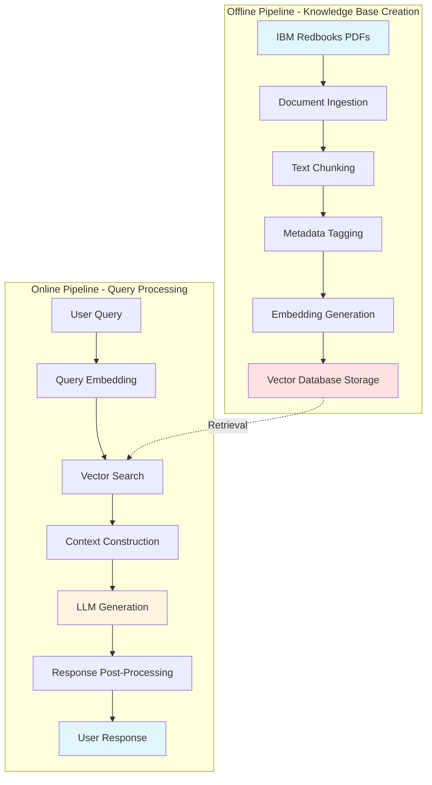
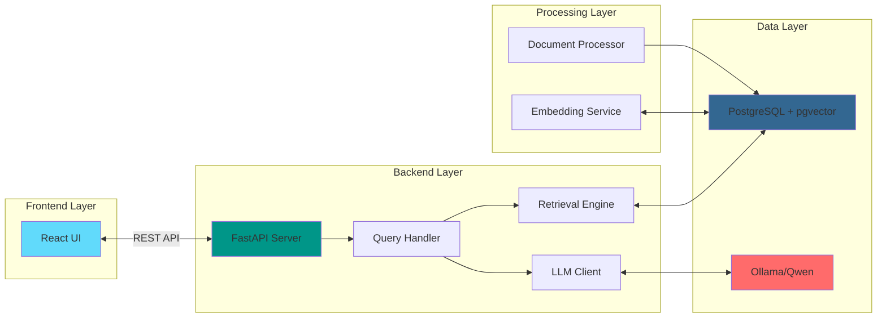
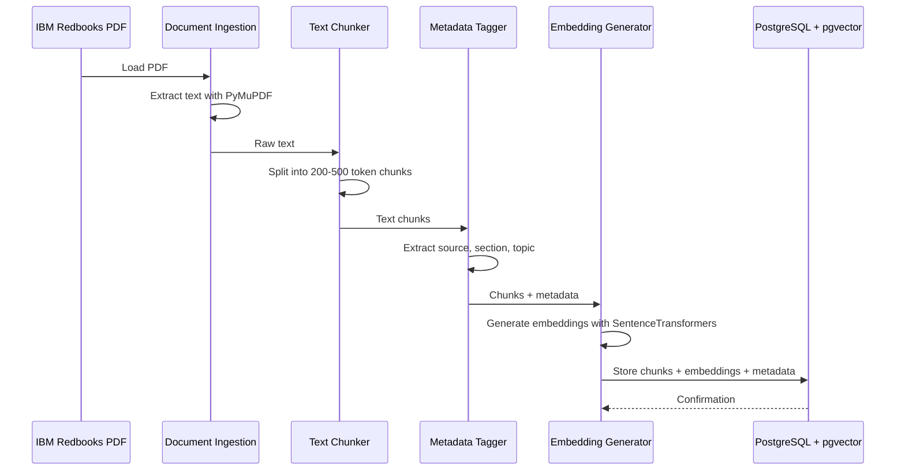
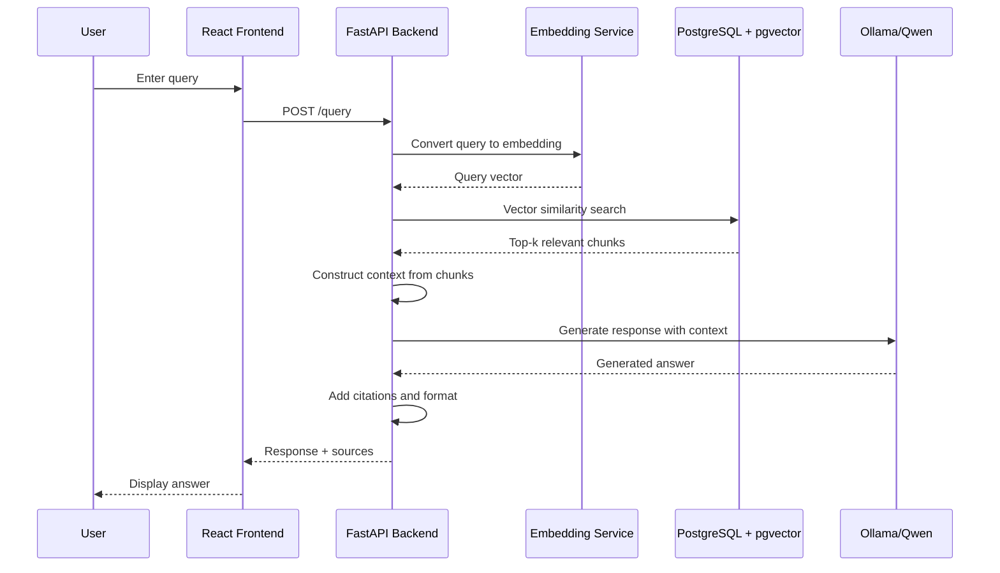

# LinuxONE RAG Knowledge Assistant - Architecture Plan

## System Overview

This document outlines the architecture for a Retrieval-Augmented Generation (RAG) system designed to query LinuxONE-related knowledge from IBM Redbooks.

## High-Level Architecture



## Component Architecture



## Data Flow - Offline Pipeline



## Data Flow - Online Pipeline



## Technology Stack

### Backend
- **Framework**: FastAPI (async, high-performance)
- **Language**: Python 3.10+
- **LLM**: Ollama with Qwen (local inference)
- **Embeddings**: SentenceTransformers (all-MiniLM-L6-v2 or similar)
- **PDF Processing**: PyMuPDF (fitz)

### Database
- **Primary DB**: PostgreSQL 15+
- **Vector Extension**: pgvector
- **Indexing**: HNSW (Hierarchical Navigable Small World)

### Frontend
- **Framework**: React 18+
- **Build Tool**: Vite
- **HTTP Client**: Axios
- **UI Components**: Material-UI or Tailwind CSS

### Infrastructure
- **Containerization**: Docker & Docker Compose
- **Local LLM**: Ollama (already running)

## Database Schema

```sql
-- Documents table
CREATE TABLE documents (
    id SERIAL PRIMARY KEY,
    filename VARCHAR(255) NOT NULL,
    title VARCHAR(500),
    source_type VARCHAR(50),
    upload_date TIMESTAMP DEFAULT CURRENT_TIMESTAMP,
    metadata JSONB
);

-- Chunks table with embeddings
CREATE TABLE chunks (
    id SERIAL PRIMARY KEY,
    document_id INTEGER REFERENCES documents(id),
    chunk_index INTEGER NOT NULL,
    content TEXT NOT NULL,
    embedding vector(384),  -- Dimension depends on embedding model
    token_count INTEGER,
    section VARCHAR(255),
    topic VARCHAR(255),
    metadata JSONB,
    created_at TIMESTAMP DEFAULT CURRENT_TIMESTAMP
);

-- Create HNSW index for fast similarity search
CREATE INDEX ON chunks USING hnsw (embedding vector_cosine_ops);
```

## Project Structure

```
LinuxONERAGPipeline/
├── backend/
│   ├── app/
│   │   ├── __init__.py
│   │   ├── main.py                 # FastAPI application
│   │   ├── config.py               # Configuration management
│   │   ├── models/
│   │   │   ├── __init__.py
│   │   │   ├── database.py         # SQLAlchemy models
│   │   │   └── schemas.py          # Pydantic schemas
│   │   ├── services/
│   │   │   ├── __init__.py
│   │   │   ├── document_processor.py
│   │   │   ├── embedding_service.py
│   │   │   ├── retrieval_service.py
│   │   │   └── llm_service.py
│   │   ├── api/
│   │   │   ├── __init__.py
│   │   │   ├── routes.py           # API endpoints
│   │   │   └── dependencies.py
│   │   └── utils/
│   │       ├── __init__.py
│   │       ├── chunking.py
│   │       └── metadata.py
│   ├── scripts/
│   │   ├── ingest_documents.py     # Offline pipeline script
│   │   └── setup_database.py       # Database initialization
│   ├── tests/
│   ├── requirements.txt
│   └── Dockerfile
├── frontend/
│   ├── public/
│   ├── src/
│   │   ├── components/
│   │   │   ├── QueryInput.jsx
│   │   │   ├── ResponseDisplay.jsx
│   │   │   └── SourceCitation.jsx
│   │   ├── services/
│   │   │   └── api.js
│   │   ├── App.jsx
│   │   └── main.jsx
│   ├── package.json
│   ├── vite.config.js
│   └── Dockerfile
├── data/
│   └── redbooks/                   # IBM Redbooks PDFs
├── docker-compose.yml
├── .env
├── .gitignore
├── README.md
└── ARCHITECTURE.md
```

## API Endpoints

### Query Endpoint
```
POST /api/query
Request:
{
  "query": "How do I optimize AI workloads on LinuxONE?",
  "top_k": 5,
  "filters": {
    "topic": "AI Workloads"
  }
}

Response:
{
  "answer": "To optimize AI workloads on LinuxONE...",
  "sources": [
    {
      "document": "Redbook XYZ",
      "section": "Chapter 3",
      "relevance_score": 0.92
    }
  ],
  "retrieved_chunks": 5
}
```

### Document Ingestion Endpoint
```
POST /api/ingest
Request: multipart/form-data with PDF file

Response:
{
  "document_id": 123,
  "chunks_created": 45,
  "status": "success"
}
```

### Health Check
```
GET /api/health
Response:
{
  "status": "healthy",
  "database": "connected",
  "llm": "available"
}
```

## Key Design Decisions

### 1. Embedding Model Selection
- **Choice**: all-MiniLM-L6-v2 (384 dimensions)
- **Rationale**: 
  - Fast inference
  - Good balance of quality and performance
  - Suitable for semantic search
  - Can be upgraded to larger models later

### 2. Chunking Strategy
- **Size**: 200-500 tokens per chunk
- **Overlap**: 50 tokens between chunks
- **Rationale**:
  - Preserves context across boundaries
  - Optimal for retrieval precision
  - Fits within LLM context windows

### 3. Vector Search Configuration
- **Index Type**: HNSW (Hierarchical Navigable Small World)
- **Distance Metric**: Cosine similarity
- **Top-K**: 5 chunks by default
- **Rationale**:
  - HNSW provides fast approximate nearest neighbor search
  - Cosine similarity works well for normalized embeddings
  - 5 chunks balance context richness and noise

### 4. LLM Integration
- **Current**: Ollama with Qwen (local)
- **Future**: Can switch to cloud LLMs or other local models
- **Rationale**:
  - Privacy and control
  - No API costs
  - Low latency
  - Demonstrates enterprise-grade local inference

## Scalability Considerations

### Local Development
- Single PostgreSQL instance
- Ollama running locally
- Suitable for datasets up to 10GB

### LinuxONE Deployment
- Distributed PostgreSQL with replication
- Multiple embedding service instances
- Load-balanced FastAPI servers
- Horizontal scaling for high concurrency
- Enterprise-grade security and compliance

## Security Measures

1. **API Authentication**: JWT tokens for API access
2. **Database Security**: Encrypted connections, role-based access
3. **Input Validation**: Sanitize all user inputs
4. **Rate Limiting**: Prevent abuse of query endpoints
5. **Audit Logging**: Track all queries and responses

## Performance Targets

- **Query Latency**: < 2 seconds end-to-end
- **Retrieval Time**: < 200ms for vector search
- **LLM Generation**: < 1.5 seconds
- **Throughput**: 10+ concurrent queries
- **Indexing Speed**: 100+ documents/minute

## Migration Path to LinuxONE

### Phase 1: Local Development (Current)
- Build and test all components locally
- Validate RAG pipeline functionality
- Optimize retrieval and generation quality

### Phase 2: Containerization
- Dockerize all services
- Create docker-compose for orchestration
- Test in containerized environment

### Phase 3: LinuxONE Deployment
- Deploy PostgreSQL on LinuxONE
- Host FastAPI backend on LinuxONE
- Run embedding models on LinuxONE
- Optional: Deploy local LLM on LinuxONE
- Configure enterprise networking and security

### Phase 4: Production Optimization
- Implement caching layers
- Add monitoring and observability
- Set up CI/CD pipelines
- Performance tuning and load testing

## Next Steps

1. Set up development environment
2. Initialize PostgreSQL with pgvector
3. Build document ingestion pipeline
4. Implement embedding and storage
5. Create FastAPI backend
6. Develop React frontend
7. Test end-to-end workflow
8. Optimize and refine
9. Prepare for LinuxONE deployment

---

**Note**: This architecture is designed to be modular and scalable, allowing for easy migration from local development to enterprise LinuxONE deployment while maintaining consistency and reliability.