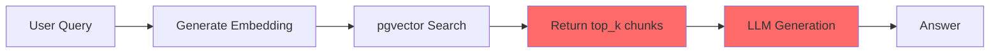
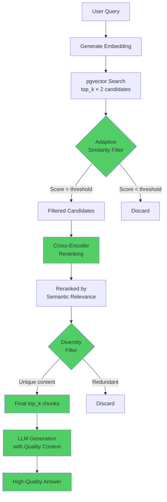
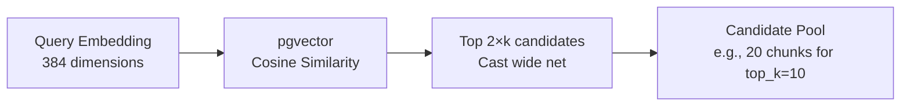
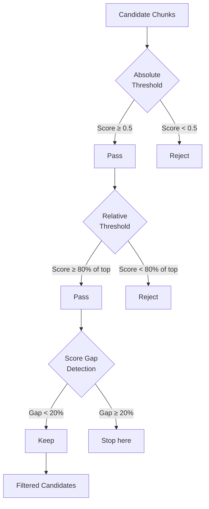
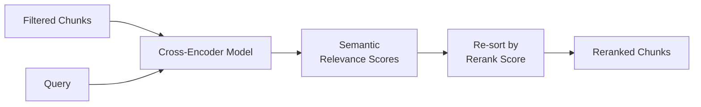
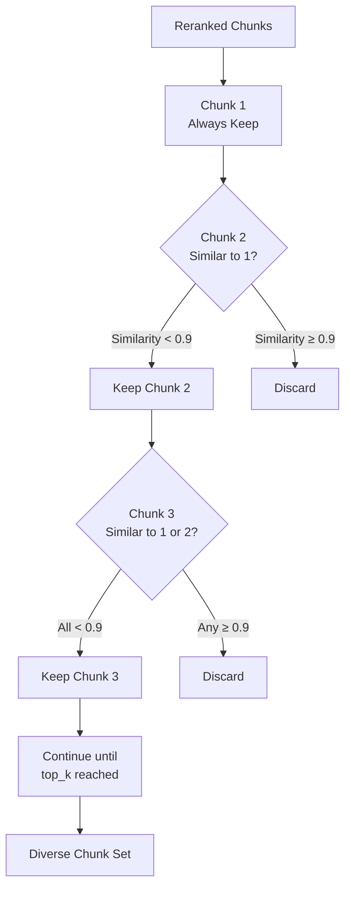
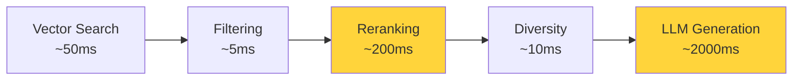
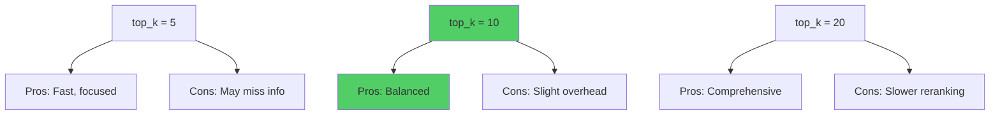
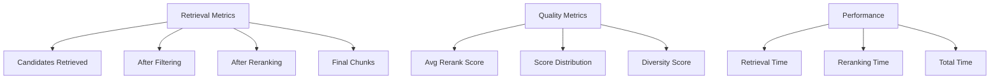

# Retrieval Pipeline Architecture

## Current vs. Improved Architecture

### Current Architecture (Problematic)



**Problems:**
- No quality filtering
- All top_k chunks passed to LLM regardless of relevance
- High top_k → context dilution → poor answers

---

### Improved Architecture (Phase 1)



**Improvements:**
- Multi-stage quality filtering
- Reranking for better relevance
- Diversity control
- Robust across different top_k values

---

## Detailed Pipeline Stages

### Stage 1: Vector Search (Candidate Retrieval)



**Purpose:** Retrieve more candidates than needed to allow filtering

**Configuration:**
- Retrieve: `top_k × 2` chunks
- No minimum threshold yet
- Fast vector search using pgvector index

---

### Stage 2: Adaptive Similarity Filtering



**Three-Level Filtering:**

1. **Absolute Minimum** (0.5)
   - Hard floor for quality
   - Prevents garbage chunks

2. **Relative Threshold** (80% of top score)
   - Adapts to query difficulty
   - Keeps contextually relevant chunks

3. **Score Gap Detection** (20% drop)
   - Stops at natural quality boundary
   - Prevents including marginal chunks

**Example:**
```
Chunk 1: 0.92 ✓ (top score)
Chunk 2: 0.89 ✓ (within 80% = 0.736)
Chunk 3: 0.85 ✓ (within threshold)
Chunk 4: 0.67 ✗ (>20% drop from 0.85)
Chunk 5: 0.65 ✗ (rejected)
```

---

### Stage 3: Cross-Encoder Reranking



**How It Works:**

**Bi-Encoder (Current):**
```
Query → Embedding A
Chunk → Embedding B
Similarity = cosine(A, B)
```
- Fast but less accurate
- Embeddings computed independently

**Cross-Encoder (New):**
```
[Query + Chunk] → Model → Relevance Score
```
- Slower but much more accurate
- Processes query and chunk together
- Captures nuanced semantic relationships

**Model:** `cross-encoder/ms-marco-MiniLM-L-6-v2`
- Trained on MS MARCO passage ranking
- Optimized for relevance scoring
- ~80MB model size

---

### Stage 4: Diversity Filtering



**Purpose:** Maximize information density

**Strategy:**
- Greedy selection (keep best first)
- Check similarity to all selected chunks
- Threshold: 0.9 (very similar = redundant)

**Example:**
```
Chunk A: "LinuxONE is a secure mainframe..." ✓
Chunk B: "LinuxONE provides security..." ✗ (too similar to A)
Chunk C: "AI workloads on LinuxONE..." ✓ (different topic)
```

---

## Data Flow Example

### Query: "How do I configure TLS encryption on LinuxONE?"

**Stage 1: Vector Search**
```
Retrieved 20 candidates:
1. TLS configuration guide (0.89)
2. Security best practices (0.87)
3. Encryption overview (0.85)
4. Network setup (0.82)
...
15. General Linux intro (0.52)
20. Hardware specs (0.45)
```

**Stage 2: Similarity Filtering**
```
After filtering (absolute > 0.5, relative > 0.71):
1. TLS configuration guide (0.89) ✓
2. Security best practices (0.87) ✓
3. Encryption overview (0.85) ✓
4. Network setup (0.82) ✓
...
10. Certificate management (0.73) ✓
11. General security (0.68) ✗ (>20% drop)
```
Result: 10 chunks

**Stage 3: Reranking**
```
Cross-encoder scores:
1. TLS configuration guide (0.95) ← moved up
2. Certificate management (0.91) ← moved up
3. Encryption overview (0.88)
4. Security best practices (0.85) ← moved down
...
```
Result: Reordered by true relevance

**Stage 4: Diversity**
```
Check similarity between chunks:
1. TLS configuration (0.95) ✓
2. Certificate management (0.91) ✓ (different aspect)
3. Encryption overview (0.88) ✗ (too similar to #1)
4. Security best practices (0.85) ✓ (broader context)
...
```
Result: 8 diverse, high-quality chunks

**Final Context to LLM:**
- 8 highly relevant chunks
- No redundancy
- Focused on TLS/encryption
- High semantic relevance

---

## Performance Characteristics

### Latency Breakdown



**Total Retrieval:** ~265ms (vs. 50ms before)
**Total Query:** ~2265ms (vs. 2050ms before)
**Overhead:** +10% latency for much better quality

### Scalability

**Vector Search:**
- O(log n) with pgvector index
- Scales to millions of chunks

**Reranking:**
- O(k) where k = filtered candidates
- Typically 10-20 chunks
- Bottleneck but acceptable

**Diversity:**
- O(k²) pairwise comparisons
- Negligible for k < 50

---

## Configuration Trade-offs

### Top K Selection



**Recommendation:** top_k = 10
- Good balance of coverage and speed
- Filtering ensures quality
- Diversity prevents redundancy

### Filtering Aggressiveness

**Strict Filtering** (threshold = 0.6):
- Pros: Very high precision
- Cons: May miss relevant info

**Moderate Filtering** (threshold = 0.5):
- Pros: Balanced precision/recall
- Cons: Occasional low-quality chunk

**Loose Filtering** (threshold = 0.4):
- Pros: High recall
- Cons: More noise, slower reranking

**Recommendation:** 0.5 (moderate)

---

## Monitoring & Debugging

### Key Metrics to Track



### Debug Checklist

**Problem: Answers too short**
- Check: Final chunk count
- Check: LLM max_tokens setting
- Check: Context quality (avg score)

**Problem: Irrelevant information**
- Check: Similarity threshold (increase?)
- Check: Reranking scores (working?)
- Check: Query embedding quality

**Problem: Missing information**
- Check: Initial candidates (enough?)
- Check: Filtering too aggressive?
- Check: Chunking granularity

**Problem: Slow responses**
- Check: Reranking batch size
- Check: Number of candidates
- Check: Database query performance

---

## Future Enhancements

### Potential Improvements

1. **Query Expansion**
   - Expand query with synonyms
   - Better coverage of relevant chunks

2. **Hybrid Search**
   - Combine vector + keyword search
   - Better for specific terms/codes

3. **Contextual Compression**
   - Compress retrieved context
   - Keep only relevant sentences

4. **Adaptive Top-K**
   - Dynamically adjust based on query
   - Simple queries → fewer chunks
   - Complex queries → more chunks

5. **Caching**
   - Cache reranking results
   - Faster for repeated queries

---

*This architecture ensures consistent, high-quality retrieval across all query types while maintaining acceptable performance.*